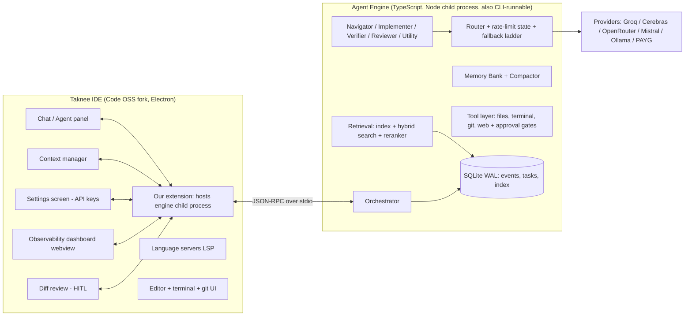
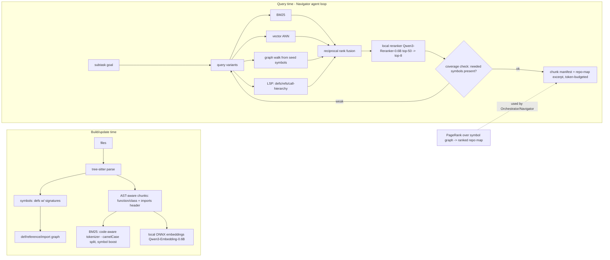

# 03 — System Architecture

Working title: **Taknee IDE** (rename before submission). Version 0.1 (planning).

## 0. Shape of the system

Two processes, one product:



**Why two processes:** the PS requires tasks to survive IDE restarts/crashes (req 6). A child process with a WAL database keeps running (or resumes cleanly) independent of the UI; it also makes the engine testable headless via CLI and keeps model-call loops out of the extension host.

**Why TypeScript for the engine:** one language across fork + extension + engine; the ecosystem (tree-sitter bindings, ONNX runtime/transformers.js, better-sqlite3, OpenAI-compatible SDKs) covers everything we need; any of the 8 teammates can work in it. (Rejected Python — see ADR-2.)

## 1. Data model (the backbone)

Everything is an append-only **event stream** persisted in SQLite (WAL mode), one DB per workspace at `<workspace>/.taknee/state.db` (index in same DB, separate tables — satisfies per-repo isolation, req 5):

- `tasks(id, prompt, status, branch, cost_usd, tokens_in/out, started_at, ...)`
- `events(id, task_id, ts, type, agent_id, parent_id, payload_json)` — every LLM call, tool call, routing decision, compaction, approval, diff review. The dashboard is a projection of this table (req 11), resume is a replay of it (req 6).
- `plan_nodes(id, task_id, kind, goal, files_scope, status, depends_on, attempts)` — the plan DAG.
- `memory(task_id, key, kind[pinned|decision|file_manifest|digest], content, version)` — the memory bank.
- `context_state(task_id, agent_id, turn, included_items_json)` — what exactly was in each agent's context at each turn (dashboard req 11.iv).
- `index(files, symbols, imports, chunks, embeddings, bm25)` — retrieval tables (§6).

Cost/time/step/token governors read the same tables → Watchdog decisions are data-driven and auditable.

## 2. Model & provider registry (req 2)

A declarative **manifest** (JSON, human-reviewed) of every model we ever call, with `total_params`, `open_weights: true`, providers serving it, prices, rate limits, context window, capabilities (tools/json-mode). The router only picks from the manifest; the manifest is the compliance artifact we show judges (params ≤ 80B, no subscriptions, free/PAYG/local only). Embedding/reranker models (0.6B) are in the same manifest — "every model used anywhere" includes them.

Model tiers (defaults, user-overridable):
- **T1 reasoning/coder:** Qwen3-Coder-30B-A3B-Instruct, Devstral Small 2 24B (backup)
- **T2 utility (cheap/fast):** Qwen3-8B/4B-class, gpt-oss-20b — summaries, titles, classification, digest generation
- **T-embed:** Qwen3-Embedding-0.6B (local ONNX, CPU)
- **T-rerank:** Qwen3-Reranker-0.6B (local ONNX, CPU)
- **T-local:** Ollama-served Qwen3-8B / Qwen2.5-Coder-7B (16GB RAM/8GB VRAM compliant fallback)

## 3. Smart routing (req 3)

**Decision inputs (all logged per call):** agent role + tier; prompt complexity score (heuristic: length, task type, plan-node difficulty declared by orchestrator, files-in-scope count); context size vs candidate model window; tokens/$ spent so far in task; live per-provider rate-limit state (sliding-window counters + last 429s); latency observations (EWMA).

**Policy ladder (deterministic, explainable — no ML router we can't defend):**
1. Filter: models whose window > context need, capability matches (tools), provider has a valid key.
2. Prefer FREE providers; within free, pick by (latency EWMA, remaining quota) and spread across providers when subtasks run in parallel.
3. Tier match: T1 for planning/implementation/review; T2 for utility work (cost discipline — req 3.a "tokens already used" shrinks tier as budget drains).
4. If free pool exhausted/429 → next provider; if all free dry → PAYG **only if** task $ governor allows; else local; else park task with clear status (never lose progress — state is in SQLite, the call just re-dispatches later; req 3.c).
5. Per-request retry ladder: same model 1× (transient) → sibling provider same model → next model in tier → downgrade tier for utility calls. All fallbacks logged and visible.

**Transparency (req 3.b):** every routing decision event carries `{chosen model, provider, reason string, alternatives considered, limits snapshot}`. UI: live badge on each agent in the chat ("Qwen3-Coder-30B @ Groq — T1 implementer, ctx 12.4K, groq ok, $0.00") + routing tab in dashboard + notification on fallback.

**Settings screen (req 3.d, MANDATORY):** per-provider key entry (Groq, OpenRouter, Cerebras, Mistral, optional Together/DeepInfra, Ollama base URL), stored via VS Code SecretStorage (OS keychain), plus toggles (enable PAYG, $ caps, default tiers). "Test key" button per provider. Built Day 1.

## 4. Multi-agent orchestration (req 1)

Roles (agents are stateless functions + memory-bank views; the loop state lives in the engine):

| Agent | Tier | Context it gets | Output |
|---|---|---|---|
| **Orchestrator** | T1 | task prompt, repo map digest, plan so far, watchdog alerts | plan DAG updates, subtask dispatch |
| **Navigator** | T2/T1 | subtask goal + retrieval tools | minimal file/chunk manifest (the working set) |
| **Implementer** | T1 | subtask goal, working set chunks, relevant decisions, AGENTS.md | SEARCH/REPLACE edit blocks |
| **Verifier** | T2 (harness) + deterministic | commands to run, test output | pass/fail + parsed errors |
| **Reviewer** | T1 | diff, subtask acceptance criteria, AGENTS.md rules | approve / fix-list |
| **Utility** | T2 | tiny prompts | digests, titles, classifications |

Task lifecycle (every phase persisted → resumable):

```mermaid
flowchart TD
    P[user prompt] --> O[Orchestrator: clarify+decompose]
    O --> PLAN[Plan DAG: subtasks w/ goals, file scope, acceptance checks]
    PLAN --> NAV[Navigator: retrieval loop per subtask]
    NAV --> IMP[Implementer: edits via SEARCH/REPLACE]
    IMP --> CP[git checkpoint commit on task branch]
    CP --> VER[Verifier: build/tests/typecheck]
    VER -->|fail| DIAG[Diagnose: parse errors, 1-2 targeted fixes]
    DIAG -->|fixed| VER
    DIAG -->|stuck| BT[Backtrack: revert checkpoint, replan subtask]
    VER -->|pass| REV[Reviewer vs acceptance + AGENTS.md]
    REV -->|issues| IMP
    REV -->|ok--> DONE[next subtask / task complete: final diff for HITL review]
    WD[Watchdog: step/token/$/time/loop caps + no-progress detector] -.escalate.-> O
```

Key design points:
- **Each step gets only what it needs** (req: "each step given only the context it actually needs"): subtask prompts are assembled from the memory bank, not from any global transcript.
- **Failure handling:** tool/apply failures → 1 repair retry with the error message; repeated failure → backtracking (git revert of the subtask checkpoint) + re-planning that node (max 2 replans/node, then plan-level rethink). Watchdog triggers: 3× identical (tool,args) hash, no working-tree change for K steps, caps on steps (~120), agents (~24), tokens, $ (§1 governors), wall-clock. On trigger: escalate to Orchestrator with a "stuck report" → replan, backtrack, or (if hard caps) graceful stop with best-effort diff + honest status. (req 1.c)
- **Parallelism without conflicts:** independent DAG leaves run concurrently; **file leases** — a node holding a file for edits blocks other implementers on that file (PS: "avoid parallel agents making conflicting changes"). Parallel calls deliberately spread across different providers (rate limits).
- **AGENTS.md** parsed at repo open → pinned memory (§5.3) → in every Implementer/Reviewer context, enforced by Reviewer checks (req 9).

## 5. Context & compaction (req 4)

**Principle: the memory bank is the source of truth; transcripts are disposable.**

- **Memory bank entries** (typed, versioned, in SQLite): task brief; plan DAG state; decisions ledger (numbered, one-line each, append-only); file manifest (per touched file: why it matters, key symbols, current state summary); tool-result digests (Verifier outputs distilled to pass/fail+errors); AGENTS.md digest; user messages (verbatim, pinned).
- **Working context assembly per turn:** system role prompt + pinned items (task brief, active subtask, relevant decisions, AGENTS.md) + working-set chunks + recent N turns. Target ≤16-24K tokens (context rot in small models — research 02 §4.3).
- **Compaction trigger:** assembled context > soft threshold (e.g., 60% of the *routing-effective* window — note windows are model-dependent, the router tells compaction the budget) → drop/digest oldest non-pinned items (bank retains originals forever). **Hard trigger** near window limit = absolutely necessary (req 4.a). Multiple compactions per task are fine because assembly is from the bank, not cumulative summaries.
- **Nothing relevant is lost (req 4.b):** pinned items never compact away; digests keep retrievable pointers (dashboard can show the pre-compaction originals — event log). Decisions ledger + file manifest are re-derivable and versioned; misremembering is prevented because facts are structured rows, not summary prose. Compaction events are logged with before/after token counts (dashboard visualizes them).

## 6. Code retrieval pipeline (req 5)

Per-repo, incremental, offline-first. Index built on folder open (background, progress shown), updated via file-watch (merkle-style per-file hash → re-parse only changed).



- **Repo map (aider-style, generalized):** PageRank over the symbol graph → token-budgeted ranked skeleton (binary-search the budget). Used by Orchestrator for planning and as cheap navigation context. No embeddings required → fast, deterministic.
- **Beyond keyword+plain-vectors (explicit judging criterion):** three orthogonal signals — lexical (BM25 code-aware), semantic (local embeddings), **structural (graph + PageRank)** — plus **LSP ground truth** when the IDE's language servers can answer definitively, plus a **learned-quality reranker**. Poor-result detection: coverage check re-queries with rephrased/expanded queries and switches strategy (agentic loop, not one-shot).
- **No file dumping:** chunks are function/class-scoped with signature + docstring headers; agents request more via tools (`read_file_lines`, `expand_symbol`). Chunk budget per turn enforced by the context assembler.
- **Isolation:** index tables keyed by absolute repo root inside the repo-local DB; no cross-repo reads, ever (req 5.b).

## 7. Long-horizon, multi-session resume (req 6)

- Every state transition is a transaction + event append (SQLite WAL) → crash at any instant leaves a consistent prefix.
- On IDE reopen: extension detects unfinished tasks → "Resume" — engine replays event log, restores plan DAG + bank + context snapshots, recreates the task's git branch state (branch exists; checkpoint commits preserve work), and continues from the exact step (pending approvals re-surface).
- Task branch model: `taknee/<task-id>`; checkpoint commit per subtask completion. Resume works even if the process died mid-tool-call (tool calls are idempotent-checked via event log before re-run).

## 8. Manual context control + `/bytheway` (req 7)

- **Context manager panel:** pinned files & code blocks with live token counts; add via @-mention autocomplete, drag-drop from editor, "add selection" context-menu; remove anytime. Manual pins override auto-retrieval (assembly order: pins → subtask working set → budget-fitted retrieval).
- **Clickable tags both ways:** agent outputs reference files/lines as structured spans (not regex-over-prose) → rendered as `path:line` links opening the editor at the position. Input box: @-file/@-symbol completion; pasted code auto-fences with the source location.
- **`/bytheway <question>`:** snapshots current context pointer, runs an isolated ephemeral thread (clean memory: repo map + retrieval allowed, task bank NOT loaded), renders nested/dimmed in the same chat, then restores the original context pointer exactly (bank untouched → zero contamination, verifiable in dashboard's context-lifetime view).

## 9. Tool layer & autonomy (req 8)

Tools: `read_file`, `search_code` (ripgrep), `retrieve` (§6), `run_terminal`, `edit_file` (SEARCH/REPLACE apply w/ fuzz + verify), `git_*` (branch/commit/diff/merge/checkout), `web_search`/`web_fetch`.
- **Risk classes:** read-only (auto) vs **side-effect (approval required, always)** — writes/deletes, installs, state-changing commands, git push/merge. Approval queue UI shows full command + expected effect; modes: per-action (default) / auto-approve-project-scope toggle (explicit user action, still logged) — the gate always exists per PS. Verification commands (tests/build) run in the task's environment with output captured to the event log.
- Deterministic safety rails: deny-list (`rm -rf /`, force-push protected branches), cwd jailed to workspace + temp, env-var scrubbing, timeout + output caps.
- Terminal/git used **as feedback** (PS: "actively use tools as feedback mechanisms"): Verifier builds the error-parse-fix loop; all runs logged (dashboard).

## 10. HITL diff review (req 10)

- Every subtask checkpoint = git commit → **accurate diffs for free** (git, not homegrown diffing).
- Review view: accumulated task diff, grouped per file, per-hunk accept/reject (+ accept-all/reject-all). Partial apply = selective `git apply` of accepted hunks; rejected hunks recorded and fed back to the agent ("these changes were rejected by the user — continue the remaining plan without them, adjust dependents") → engine re-verifies and continues around rejections (req 10.c).
- After review, changes squash onto the user's branch only on final accept; task branch retained for audit.

## 11. Observability dashboard (req 11)

One webview, two modes over the same data (live = subscribe to event stream; after = replay from SQLite — no gaps by construction):
- **Trace tree:** task → agents → LLM/tool calls (full hierarchy, parent/child, timings) — from `events`.
- **Node drill-down:** exact prompt/completion, tool input/output, routing decision + reason + alternatives, retries/fallbacks.
- **Live thoughts:** streaming agent reasoning steps (structured log between calls, not hidden chain-of-thought text).
- **Context lifetime view:** per agent, per turn — what was included (pins, chunks, digests) and token count → makes compaction events and `/bytheway` isolation *visible* (judges can verify req 4/7 claims here).
- **Cost/time panel:** per-agent tokens & $ (model×provider×price), task totals vs governor limits.
- Export trace as JSON (for our own eval harness + judges' inspection).

## 12. Cross-cutting: the eval harness (our secret weapon)

A CLI harness driving the engine headless on a fixed local task set (curated SWE-bench-style tasks on open-source repos) measuring accuracy/cost/time — the same three numbers the judges use. Used nightly from Day 3 to tune: routing thresholds, context budgets, retry/backtrack caps, verifier loop depth. **This is how we "try more than one approach and compare" — with numbers — for every core component (docs score depends on it).**
